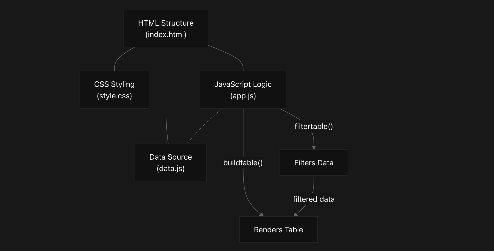
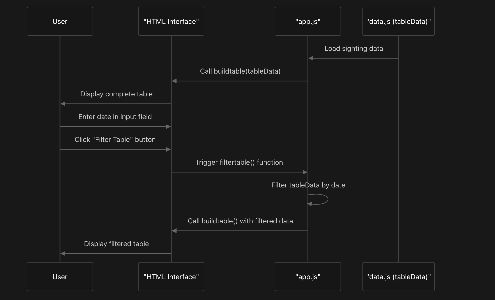
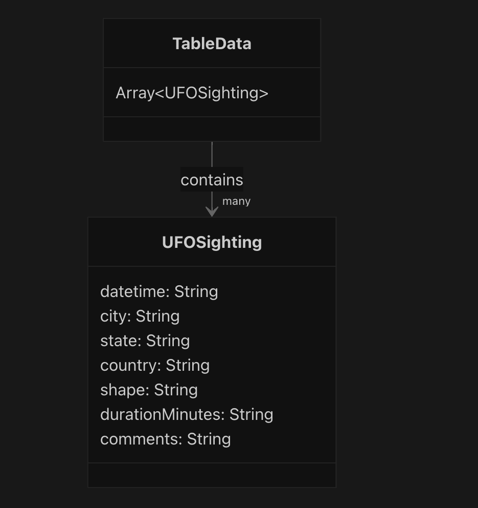

# javascript-challenge Overview
## Purpose & Scope
This document provides an introduction to the JavaScript UFO Sightings Dashboard, a client-side web application that displays and filters UFO sighting data. The dashboard allows users to enter a date and filter a table of UFO sightings to show only records from the specified date. This page covers the general purpose, architecture, and functionality of the application. 
## System Description
The JavaScript UFO Sightings Dashboard is a single-page web application that presents UFO sighting data in a tabular format. The application loads a dataset of UFO sightings and renders it as an HTML table. Users can filter this data by entering a date into a form input field and clicking a filter button, which updates the table to display only matching records.
### Key Features
- Display of UFO sighting data in a responsive table format
- Date-based filtering functionality
- Clean, modern user interface with space-themed styling
- Client-side data processing (no server required)
## High-Level Architecture
The application follows a standard web architecture with clear separation of concerns:

Title: Core Application Architecture

### Core Components
The application consists of four main components:

1. HTML Structure: Provides the page layout, including the navigation bar, hero section, filter form, and table container
2. CSS Styling: Handles the visual presentation, responsive design, and animations
3. JavaScript Logic: Implements the interactive functionality, including table building and filtering
4. Data Source: Contains the UFO sighting records as a JavaScript array

### Data Flow
The following diagram illustrates how data flows through the application:
 

### Key Functions
The application's core functionality is implemented through two main JavaScript functions:

buildtable(data): Dynamically creates the HTML table from an array of sighting data
- Clears any existing table content
- Creates a new table row for each sighting
- Populates cells with sighting data values

filtertable(): Filters the data based on user input
- Retrieves the date value from the input field
- Filters the dataset to include only records matching the entered date
- Calls buildtable() with the filtered dataset to update the display
- The following table shows the relationship between user actions and system functions:

User Action	Triggered Function	Result
Page load	buildtable(tableData)	Complete table of sightings displayed
Enter date & click filter	filtertable()	Filtered table shows only matching dates
Sources: 
javascript-challenge-master/ufo-level1/README.MD
6-32

### Data Model
The application uses a simple data model where each UFO sighting is represented as a JavaScript object with specific properties:


### Implementation Overview
The application uses the D3.js library for DOM manipulation and event handling. Key implementation details include:

The sighting data is stored in a variable named tableData
The buildtable() function uses D3 to select the table body and append rows and cells
The filtertable() function uses JavaScript's filter method to create a subset of the data
Event listeners are attached to the filter button to trigger the filtering functionality

This code snippet shows the core filtering logic:

```
function filtertable(){
    var date = d3.select("#datetime").property("value")
    var filterdata = tableData
    if(date){
        filterdata = filterdata.filter(datarow=>datarow.datetime==date)
    };
    buildtable(filterdata)
};
```
### Summary
The JavaScript UFO Sightings Dashboard demonstrates effective use of client-side web technologies to create an interactive data filtering application. Its architecture follows a clean separation of concerns, making the codebase maintainable and extensible. The current implementation filters by date only, but the design could easily be extended to support additional filtering criteria.
